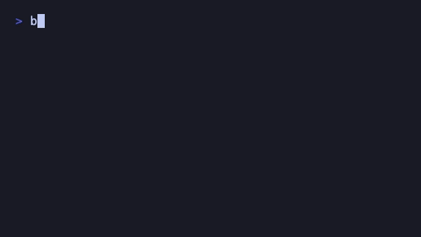
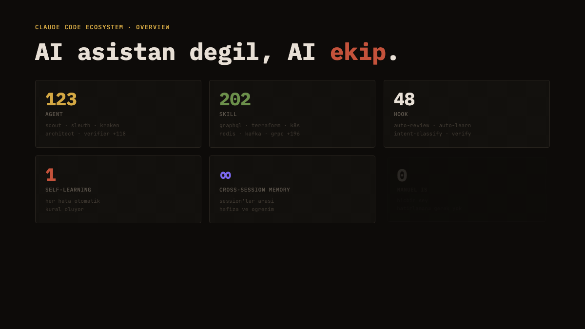

<div align="center">

# vibecosystem

**Your AI software team. Built on Claude Code.**

[](https://opensource.org/licenses/MIT)
[](#agents)
[](#skills)
[](#hooks)
[](#rules)
[](https://github.com/vibeeval/vibecosystem/actions/workflows/validate.yml)

[Turkce](#turkce) | [English](#english) | [Espanol](docs/README_ES.md) | [Francais](docs/README_FR.md) | [Deutsch](docs/README_DE.md) | [Portugues](docs/README_PT.md) | [Italiano](docs/README_IT.md) | [Nederlands](docs/README_NL.md) | [中文](docs/README_ZH.md) | [日本語](docs/README_JA.md) | [한국어](docs/README_KO.md) | [العربية](docs/README_AR.md) | [हिन्दी](docs/README_HI.md) | [Русский](docs/README_RU.md)


</div>

vibecosystem turns Claude Code into a full AI software team — 119 specialized agents that plan, build, review, test, and learn from every mistake. No configuration needed — just install and code.

> **v1.3**: 6 new SaaS skills (payment patterns, auth patterns, email infrastructure, KVKK/GDPR compliance, analytics patterns, launch checklist) + 2 enriched skills. See [UPGRADING.md](UPGRADING.md) for details.

## The Problem

Claude Code is powerful, but it's one assistant. You prompt, it responds, you review. For complex projects you need a planner, a reviewer, a security auditor, a tester — and you end up being all of them yourself.

## The Solution

vibecosystem is a complete [Claude Code](https://docs.anthropic.com/en/docs/claude-code) ecosystem that creates a self-organizing AI team:

1. **119 agents** — specialized roles from frontend-dev to security-analyst
2. **214 skills** — reusable knowledge from TDD workflows to Kubernetes patterns
3. **49 hooks** — TypeScript sensors that observe, filter, and inject context
4. **21 rules** — behavioral guidelines that shape every agent's output
5. **Self-learning** — every error becomes a rule, automatically

After setup, you say "build a feature" and 20+ agents coordinate across 5 phases.

<a name="english"></a>

## Quick Start

```bash
git clone https://github.com/vibeeval/vibecosystem.git
cd vibecosystem
./install.sh
```

That's it. Use Claude Code normally. The team activates.

## How It Works

```
YOU SAY SOMETHING                VIBECOSYSTEM ACTIVATES              RESULT
┌──────────────┐                 ┌──────────────────────┐            ┌──────────┐
│ "add a new   │──→ Intent ──→  │ Phase 1: scout +     │──→ Code   │ Feature  │
│  feature"    │   Classifier   │   architect plan     │   Written │ built,   │
│              │                 │ Phase 2: backend-dev │   Tested  │ reviewed,│
│              │                 │   + frontend-dev     │   Reviewed│ tested,  │
│              │                 │ Phase 3: code-review │           │ merged   │
│              │                 │   + security-review  │           │          │
│              │                 │ Phase 4: verifier    │           │          │
│              │                 │ Phase 5: self-learner│           │          │
└──────────────┘                 └──────────────────────┘            └──────────┘
```

**Hooks** are sensors — they observe every tool call and inject relevant context:
```
"fix the bug"       → compiler-in-loop + error-broadcast      ~2,400 tok
"add api endpoint"  → edit-context + signature-helper + arch   ~3,100 tok
"explain this code" → (nothing extra)                          ~800 tok
```

**Agents** are muscles — each one specialized for a specific job:
```
GraphQL API      → graphql-expert   (backup: backend-dev)
Kubernetes       → kubernetes-expert (backup: devops)
DDD modeling     → ddd-expert       (backup: architect)
Bug reproduction → replay           (backup: sleuth)
... 70 more routing rules
```

**Self-Learning Pipeline** turns mistakes into permanent knowledge:
```
Error happens → passive-learner captures pattern (+ project tag)
→ consolidator groups & counts (per-project + global)
→ confidence >= 5 → auto-inject into context
→ 2+ projects, 5+ total → cross-project promotion
→ 10x repeat → permanent .md rule file
```

No manual intervention. The system writes its own rules — and shares them across projects.

## Core Features

### Agent Swarm

Say "add a new feature" and 20+ agents activate across 5 phases.



```
Phase 1 (Discovery):    scout + architect + project-manager
Phase 2 (Development):  backend-dev + frontend-dev + devops + specialists
Phase 3 (Review):       code-reviewer + security-reviewer + qa-engineer
Phase 4 (QA Loop):      verifier + tdd-guide (max 3 retry → escalate)
Phase 5 (Final):        self-learner + technical-writer
```

### Self-Learning Pipeline

Every error becomes a rule. Automatically.


### Dev-QA Loop

Every task goes through a quality gate:

```
Developer implements → code-reviewer + verifier check
→ PASS → next task
→ FAIL → feedback to developer, retry (max 3)
→ 3x FAIL → escalate (reassign / decompose / defer)
```

### Cross-Project Learning

Patterns learned in one project automatically benefit all your projects.

```
Project A: add-error-handling (3x) ─┐
                                     ├→ 2+ projects, 5+ total → GLOBAL
Project B: add-error-handling (4x) ─┘
                                     ↓
Next session in ANY project → "add-error-handling" injected as global pattern
```

Each project gets its own pattern store. When the same pattern appears in 2+ projects with 5+ total occurrences, it's promoted to a global pattern that benefits every project — even brand new ones.

```bash
node ~/.claude/hooks/dist/instinct-cli.mjs portfolio      # All projects
node ~/.claude/hooks/dist/instinct-cli.mjs global          # Global patterns
node ~/.claude/hooks/dist/instinct-cli.mjs project <name>  # Project detail
node ~/.claude/hooks/dist/instinct-cli.mjs stats           # Statistics
```

### Canavar Cross-Training

When one agent makes a mistake, the entire team learns from it.

```
Agent error → error-ledger.jsonl → skill-matrix.json
→ All agents get the lesson at session start
→ Team-wide error prevention
```

### Adaptive Hook Loading

49 hooks exist but they don't all run at once. Intent determines which hooks fire.


---

## Architecture



```
┌─────────────────────────────────────────────────────────┐
│                    Claude Code                          │
│                                                         │
│  ┌──────────┐  ┌──────────┐  ┌──────────┐              │
│  │  Hooks   │  │  Agents  │  │  Skills  │              │
│  │  (49)    │→ │  (119)   │← │  (214)   │              │
│  └────┬─────┘  └────┬─────┘  └──────────┘              │
│       │              │                                   │
│       ▼              ▼                                   │
│  ┌──────────┐  ┌──────────┐                              │
│  │  Rules   │  │  Memory  │                              │
│  │  (21)    │  │ (PgSQL)  │                              │
│  └──────────┘  └──────────┘                              │
│                                                         │
│  ┌──────────────────────────────────────┐                │
│  │  Self-Learning Pipeline             │                │
│  │  instincts → consolidate → rules    │                │
│  │  + cross-project promotion          │                │
│  └──────────────────────────────────────┘                │
│                                                         │
│  ┌──────────────────────────────────────┐                │
│  │  Canavar Cross-Training             │                │
│  │  error-ledger → skill-matrix → team │                │
│  └──────────────────────────────────────┘                │
└─────────────────────────────────────────────────────────┘
```

---

## Agent Categories

| Category | Count | Examples |
|----------|-------|---------|
| Core Dev | 12 | frontend-dev, backend-dev, kraken, spark, devops |
| Review & QA | 8 | code-reviewer, security-reviewer, verifier, qa-engineer |
| Domain Experts | 35 | graphql-expert, kubernetes-expert, ddd-expert, redis-expert |
| Architecture | 8 | architect, planner, clean-arch-expert, cqrs-expert |
| Testing | 6 | tdd-guide, e2e-runner, arbiter, mocksmith |
| DevOps & Cloud | 12 | aws-expert, gcp-expert, azure-expert, terraform-expert |
| Analysis | 10 | scout, sleuth, data-analyst, profiler, strategist |
| Orchestration | 16 | nexus, sentinel, commander, neuron, vault, nitro |
| Documentation | 5 | technical-writer, doc-updater, copywriter, api-doc-generator |
| Learning | 7 | self-learner, canavar, reputation-engine, session-replay-analyzer |

---

## Comparison

| Feature | vibecosystem | Single Claude Code | Cursor | aider |
|---------|:----------:|:------------------:|:------:|:-----:|
| Specialized agents | **119** | 0 | 0 | 0 |
| Self-learning | **Yes** | No | No | No |
| Agent swarm coordination | **Yes** | No | No | No |
| Cross-project learning | **Yes** | No | No | No |
| Cross-agent error training | **Yes** | No | No | No |
| Dev-QA retry loop | **Yes** | No | No | No |
| Adaptive hook loading | **Yes** | No | No | No |
| Assignment matrix routing | **Yes** | No | No | No |
| Claude Code native | **Yes** | Yes | No | No |
| Zero config after install | **Yes** | Yes | No | No |

---

## What's Included

| Component | Count | Description |
|-----------|-------|-------------|
| `agents/` | 119 | Markdown agent definitions with specialized prompts |
| `skills/` | 214 | Reusable knowledge — TDD, security, patterns, frameworks |
| `hooks/src/` | 49 | TypeScript hooks — sensors, learners, validators |
| `rules/` | 21 | Behavioral guidelines — coding style, safety, QA |

---

## Tech Stack

| Component | Technology |
|-----------|-----------|
| Runtime | Claude Code (Claude Max) |
| Models | Opus 4.6 / Sonnet 4.6 |
| Hook engine | TypeScript → esbuild → .mjs |
| Memory DB | PostgreSQL + pgvector (Docker) |
| Agent format | Markdown + YAML frontmatter |
| Skill format | prompt.md / SKILL.md |
| Cross-training | JSONL ledger + JSON skill matrix |
| Cross-project learning | Per-project instinct stores + global promotion |

---

## Philosophy

```
hooks are sensors. observe, filter, signal.
agents are muscles. build, produce, fix.
the bridge between them: context injection.
no direct RPC. no message passing. by design.
implicit coordination through context.
```

---

## Data & Privacy

- All data stays on your machine (`~/.claude/`)
- No network requests, no telemetry, no cloud sync
- Self-learned rules go to `~/.claude/rules/`
- Hooks run locally via Claude Code's native hook system

---

## Inspired By

vibecosystem stands on the shoulders of great open-source projects:

- **[Shannon](https://github.com/KeygraphHQ/Shannon)** by KeygraphHQ — Result<T,E> pattern, pentest pipeline, comment philosophy
- **[UI UX Pro Max](https://github.com/nextlevelbuilder/ui-ux-pro-max)** by nextlevelbuilder — Named UX rules, UI style catalog, design token architecture
- **[Game Studios](https://github.com/Donchitos/game-studios)** by Donchitos — Context resilience, incremental writing, gate-check system
- **[Skill Gateway](https://github.com/buraksu42/skill-gateway)** by buraksu42 — Invisible skill routing, external catalog, one-question rule
- **[Pyxel](https://github.com/kitao/pyxel)** by kitao — Retro game engine patterns, pixel art constraints, MML audio

---

## Contributing

Contributions welcome! Areas where help is needed:

- **More agent definitions** — specialized roles for your domain
- **More skill patterns** — framework-specific knowledge (Rails, Flutter, etc.)
- **Better hooks** — new sensors, smarter context injection
- **Documentation** — tutorials, guides, examples
- **Translations** — improve existing or add new languages

---

<a name="turkce"></a>

## Turkce

### Nedir?

vibecosystem, Claude Code'u tam bir AI yazilim ekibine donusturur. Tek bir asistan degil — planlayan, gelistiren, review yapan, test eden ve her hatasindan ogrenen **119 uzman agent'lik bir ekip**.

Ozel model yok. Ozel API yok. Sadece Claude Code'un hook + agent + rules sistemi, sonuna kadar kullanilmis.

### Hizli Baslangic

```bash
git clone https://github.com/vibeeval/vibecosystem.git
cd vibecosystem
./install.sh
```

### Nasil Calisir?

1. **Hook'lar sensor** — gozlemler, filtreler, isaret eder
2. **Agent'lar kas** — calisir, uretir, duzeltir
3. **Aralarindaki kopru:** context injection
4. **Direkt RPC yok** — bilerek boyle
5. **Context uzerinden implicit koordinasyon** calisiyor

### Felsefe

```
Kullanicinin hicbir sey hatirlamasina gerek yok.
Her sey otomatik.
```

---

## License

MIT

---

<div align="center">

**Built by [@vibeeval](https://x.com/vibeeval)**

No custom model. No custom API. Just good engineering.

</div>
